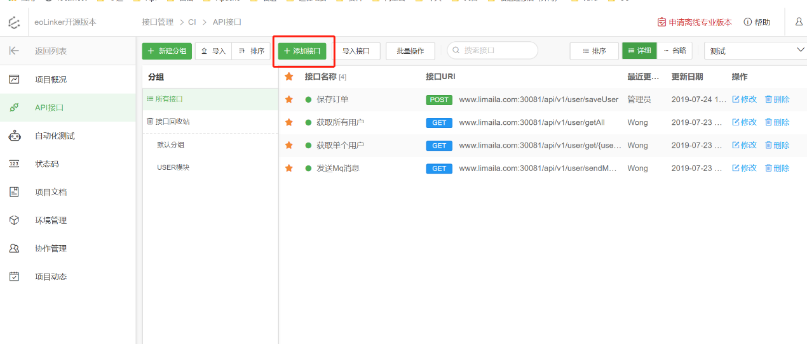
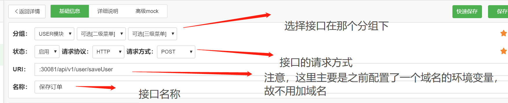
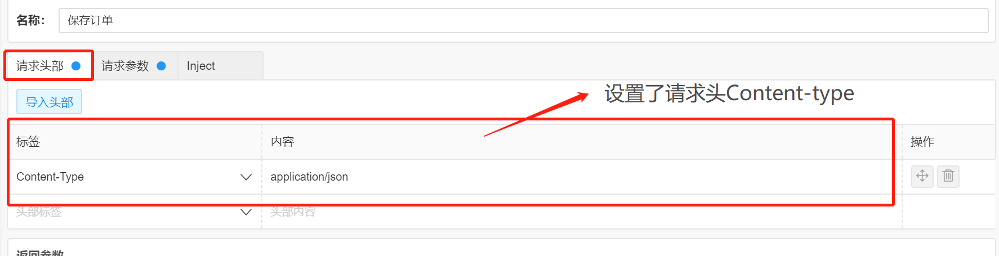
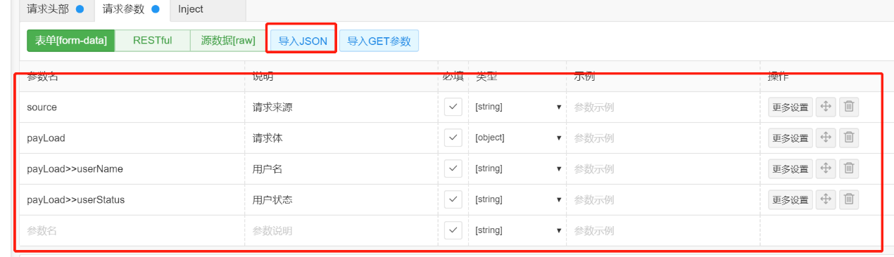
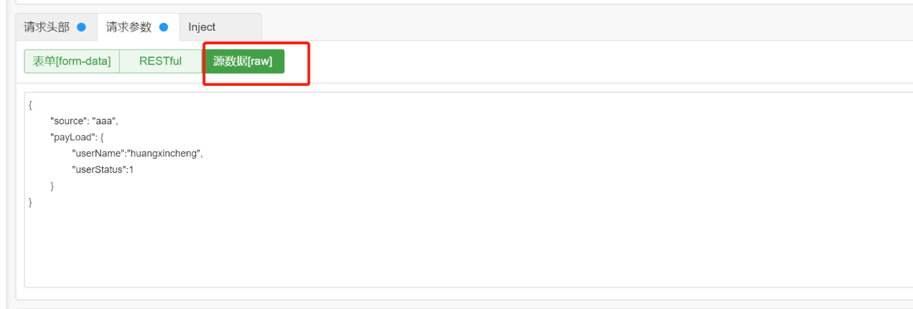
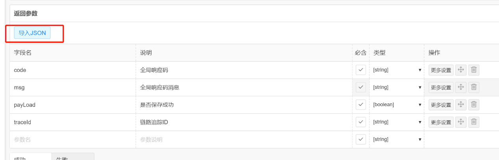

# 新增API/编辑API

## 说明
+ **URI: 注意由于我们可以勾选环境，故不用填写域名和http://**

+ **请求方式： 如果是POST且Content-Type是application/json,正常情况下是不用填写表单form-data的内容的，
只需填写源数据raw中的JSON，但是为了在接口预览中更加直观的查看api详细情况，故要用导入JSON的形式填写表单form-data的数据**

+ **请求头部： 注意如果是POST且是非表单提交的一定要填写Content-Type=application/json**

+ **返回参数： 使用导入JSON的形式导入响应体内容，在接口预览时候能更加清晰查看api详细情况**

## 示例图

